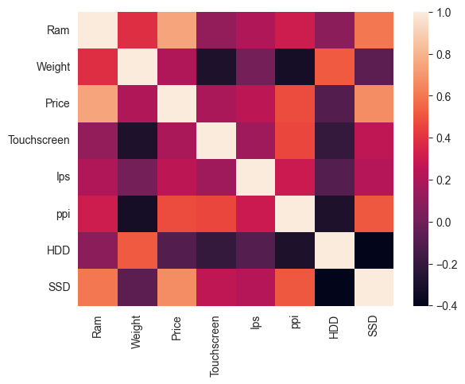

# _`PricePredictorX`_ : The Scientific guess work...

_Welcome to the PricePredictorX! This application leverages machine learning techniques to predict the prices of products or services._

 &nbsp;  &nbsp;&nbsp; 
&nbsp;  &nbsp; 


## Table of Contents

- [Features](#features)
- [Technologies Used](#technologies-used)
- [Installation](#installation)
- [Usage](#usage)
- [Data](#data)
- [Model Training](#model-training)
- [Results](#results)
- [Contributing](#contributing)
- [Contact](#contact)

## Features

- **Data Preprocessing**: Clean and preprocess data for optimal model performance.
- **Multiple Algorithms**: Experiment with different machine learning algorithms.
- **Model Evaluation**: Evaluate models using various metrics.
- **Visualization**: Visualize data and prediction results with charts and graphs.
- **User Interface**: Simple UI to input data and view predictions.

## Technologies Used

- Python
- Pandas
- NumPy
- Scikit-Learn
- Matplotlib
- Streamlit (for web interface)
- Jupyter Notebook
- Linux (for development environment)

&nbsp;

## Installation

1. Clone the repository:
    ```sh
    git clone https://github.com/HarshalMPatil20/PricePredictorX.git
    ```

2. Install the required packages:
    ```sh
    pip install -r requirements.txt
    ```
&nbsp;

## Usage

1. Preprocess your data:
    ```sh
    python laptop_price_predictor.ipynb
    ```
3. Run the app:
    ```sh
    python app.py
    ```
4. Open your web browser and go to:
    ```
    http://127.0.0.1:8501/
    ```
5. For same Network :
    ```
     Network URL: http://192.168.10.41:8501
     ```
&nbsp;

## Data

- Ensure your data is in CSV format.
- The dataset should contain relevant features that influence the price.
- Example of a data structure:
    
    | Company | TypeName | Inches | ScreenResolution | Cpu | Ram| Memory | Gpu	| OpSys | Weight | Price |
    |----------|----------|----------|-----|-------|-------|-------|-------|-------|-------|-------|
    | HP   | Notebook	   | 15.6   | Full HD 1920x1080 | Intel Core i5 7200U 2.5GHz |8GB | 256GB SSD | Intel HD Graphics 620	 | windows OS | 1.86kg | 30636.0000 |
    
&nbsp;

## Model Training

- Various machine learning models are supported, including Linear Regression, Decision Trees, and Random Forest.
- Adjust the parameters and experiment with different models in the `train.py` script.

    &nbsp; 

&nbsp;
## Results

- View the model performance metrics in the console.
- Predictions are displayed in the web interface with visualization for better understanding.

    &nbsp;  &nbsp;

    &nbsp;      

    &nbsp;  &nbsp; 
    
    &nbsp; 


&nbsp;

## Contributing

I welcome contributions from the community! If you have suggestions, improvements, or additional examples, please feel free to open an issue or submit a pull request. Your feedback and collaboration are highly appreciated : 

1. Fork the repository and create a new branch for your contributions.
2. Add your changes (code examples, documentation, etc.) to the appropriate directories.
3. Write clear and concise commit messages.
4. Submit a pull request to merge your changes into the main branch.

For more information on contributing, refer to the CONTRIBUTING.md file in this repository.


&nbsp;

## Contact

If you have any questions, suggestions, or just want to connect, you can reach out to me via:

- Email: Harshalmpatil210@gmail.com
- GitHub Issues: [Issues Page](https://github.com/HarshalMPatil20/PricePredictorX/issues)

Thank you for your interest in this OOP repository. Happy coding!

Best regards,  
Harshal Patil

&nbsp;


<div align="center">
  <a href="harshalmpatil210@gmail.com" target="_blank">
    
  </a> &nbsp; 
  <a href="https://www.linkedin.com/in/harshal-patil-87626022a/" target="_blank">
    
  </a> &nbsp;
  <a href="discordapp.com/users/530693021193469973" target="_blank">
    
  </a> &nbsp;
  <a href="https://www.instagram.com/ll_harshal_patil_ll?igsh=OGhndmNwbjVuNHJq" target="_blank">
    
  </a> &nbsp;
</div>


